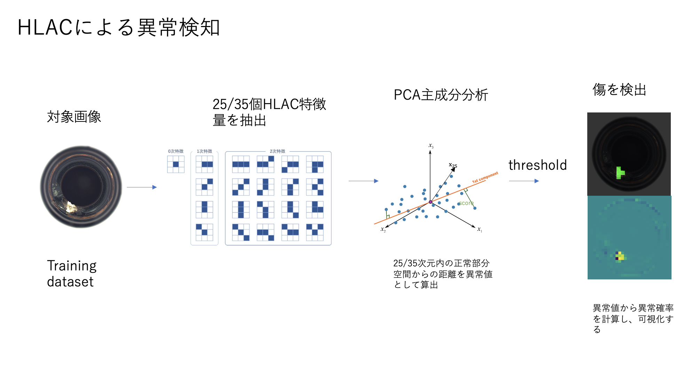
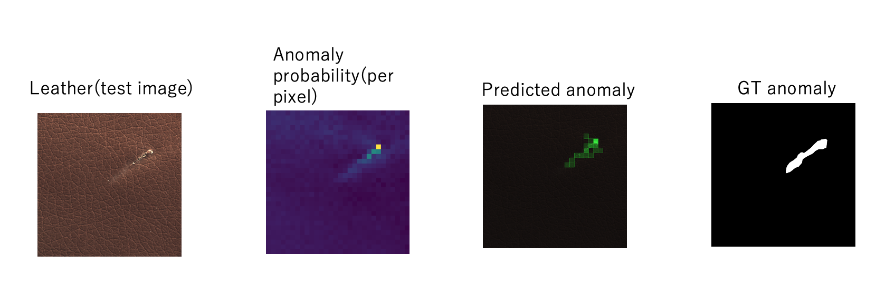
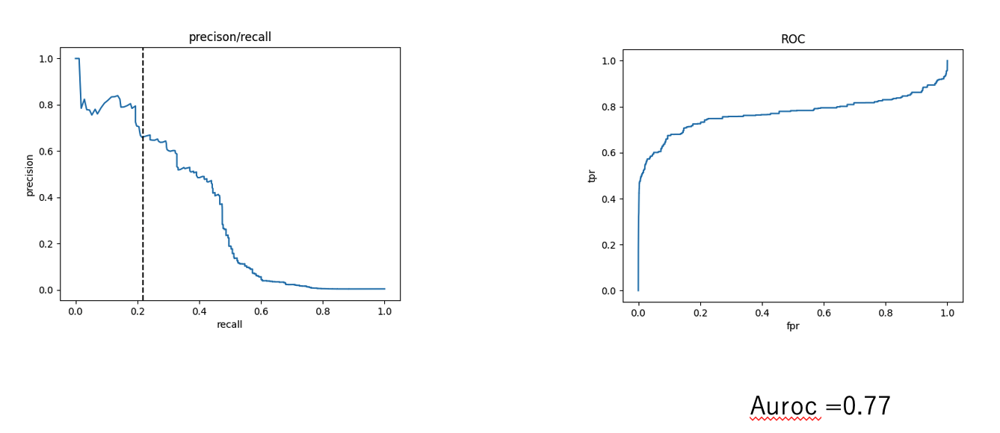
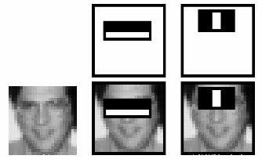
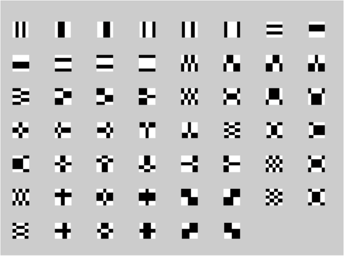
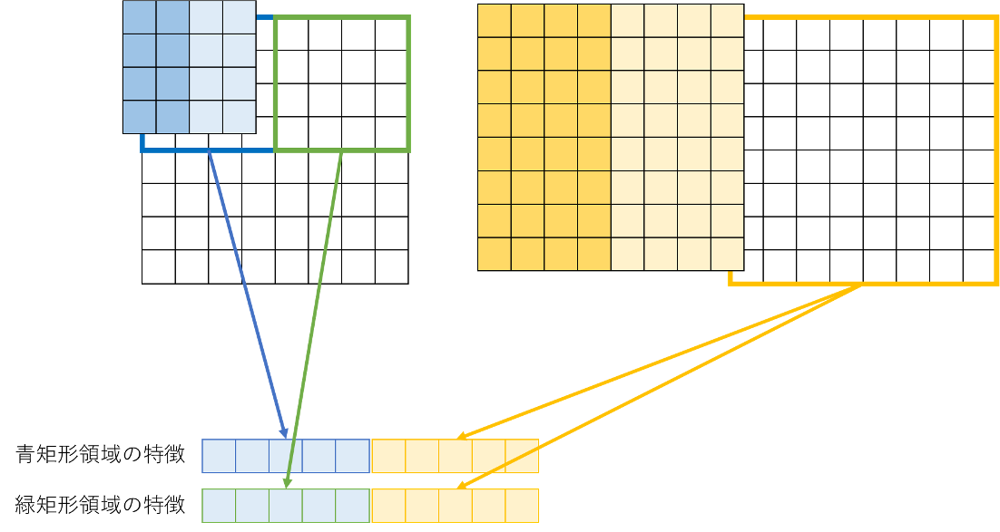

# Anomaly detection by HLAC and Haar-like

## Introdution

HLAC is a feature extraction method used for the analysis and recognition of images, etc. It is versatile, high-speed, and has excellent recognition accuracy.
Since it can be calculated by product-sum operations, the shape and size of the object can be recognized instantly using a normal PC.
In addition, since it is position invariant (does not depend on the position of the object), segmentation is not required (segmentation free).
Furthermore, it has characteristics preferable for image recognition such as additivity
(if there are two objects in an image, the sum of the respective features result in the feature of the whole image).

If you want to know more about it you can check out this [website](https://zenn.dev/kotaro_inoue/articles/f0cbbca962313b)
This is the [paper](https://www.aist.go.jp/pdf/aist_j/synthesiology/vol04_02/vol04_02_p70_p79.pdf). There have 25 patterns and 35 patterns masks for HLAC. You can use both of them in this projection.

## Approach

After extracting the HLAC features of the data to be analyzed ,
the range (subspace) of data that is considered "normal" is determined by principal component analysis,
and the distance of deviation from the subspace is determined as abnormal value.(I use F1 score to decide threshold.)

## Run HLAC

At the first, you have to download the datasets from [MVTec](https://www.mvtec.com/company/research/datasets/mvtec-ad)(for example ,download the dataset called 'leather'). Then put 'leather' floder into './datasets'. Finally, you can run './anomaly_detection.py' for demo. You can see the output of anomaly probability, ROC curve and precision_recall curve.

## HLAC result

## Compare with Haar-like

### what is Haar?

Haar-like features are digital image features used in object recognition.A simple rectangular Haar-like feature can be defined as the difference of the sum of pixels of areas inside the rectangle, which can be at any position and scale within the original image. If you want to know more about it, please check this [website](https://en.wikipedia.org/wiki/Haar-like_feature)

## Extended set of Haar-like

Haar-like only has five kinds of masks, it is not enough if we want to compare it with HLAC. So I use a extended set of Haar-like. You can download it from [here](https://drive.google.com/file/d/1-DhKRgVuH-t0YcNOFxywq2rAmF9wX_4k/view?usp=sharing)

## Cascade connection

I use Cascade connection with Haar-like

## Run Haar-like

You can run './haar_test.py' for demo. You can see the output of anomaly probability, ROC curve and precision_recall curve.
